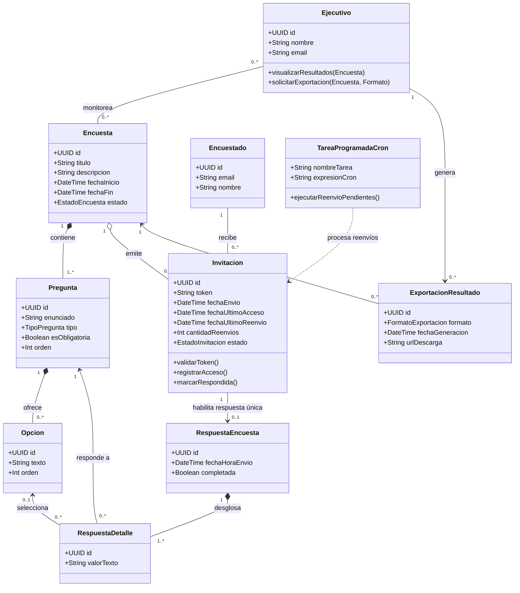

A continuación se presenta el modelo de dominio estructurado a partir de los requerimientos y detalles de diseño provistos.

---

### 1. Clases del Dominio y Atributos Principales

* **`Encuesta`**: Representa cada encuesta gestionada por el sistema. Puede haber múltiples activas en paralelo.
  * *Atributos*: `id`, `titulo`, `descripcion`, `fechaInicio`, `fechaFin`, `estado` (Borrador, Publicada/Activa, Finalizada).
* **`Pregunta`**: Cada una de las interrogantes que conforman una encuesta.
  * *Atributos*: `id`, `enunciado`, `tipo` (Opción múltiple, Texto libre, Escala, etc.), `esObligatoria`, `orden`.
* **`Opcion`**: Alternativa seleccionable en preguntas de tipo cerrada / opción múltiple.
  * *Atributos*: `id`, `texto`, `orden`.
* **`Encuestado`**: Usuario destinatario de la encuesta.
  * *Atributos*: `id`, `email`, `nombre`.
* **`Invitacion`**: Vínculo entre un encuestado y una encuesta. Es el componente central para el **seguimiento, reenvío y control de respuesta única**.
  * *Atributos*: `id`, `token` (hash/UUID único del link), `fechaEnvio`, `fechaUltimoAcceso`, `cantidadReenvios`, `fechaUltimoReenvio`, `estado` (Pendiente, Enviada, Accedida, Respondida, Expirada).
* **`RespuestaEncuesta`**: Encabezado del envío realizado por un encuestado al completar la encuesta.
  * *Atributos*: `id`, `fechaHoraEnvio`, `completada` (booleano).
* **`RespuestaDetalle`**: Respuesta concreta dada a una pregunta en particular.
  * *Atributos*: `id`, `valorTexto` (si es abierta), `opcionSeleccionadaId` (si es cerrada).
* **`Ejecutivo`**: Usuario con privilegios de gestión, visualización y exportación de datos.
  * *Atributos*: `id`, `nombre`, `email`, `cargo`.
* **`ExportacionResultado`**: Archivo/reporte consolidado generado por un ejecutivo a partir de los resultados de una encuesta.
  * *Atributos*: `id`, `formato` (CSV, XLSX, PDF), `fechaGeneracion`, `urlDescarga`.
* **`TareaProgramadaCron`** *(Componente/Servicio de control de proceso)*: Ejecuta periódicamente casos de uso como la detección de invitaciones no respondidas para reenvío automático o el cierre de encuestas vencidas.
  * *Atributos*: `id`, `tipoTarea`, `periodicidad`, `fechaUltimaEjecucion`, `estado`.

---

### 2. Relaciones y Cardinalidades

| Clase Origen | Cardinalidad | Tipo de Relación | Cardinalidad | Clase Destino | Descripción / Justificación |
| :--- | :---: | :---: | :---: | :---: | :--- |
| **Encuesta** | `1` | Composición | `1..*` | **Pregunta** | Una encuesta debe tener al menos una pregunta; si se elimina la encuesta, sus preguntas dejan de existir. |
| **Pregunta** | `1` | Composición | `0..*` | **Opcion** | Preguntas cerradas contienen opciones; preguntas abiertas tienen `0` opciones. |
| **Encuesta** | `1` | Asociación | `0..*` | **Invitacion** | Para una encuesta se generan múltiples invitaciones (una por cada encuestado). |
| **Encuestado** | `1` | Asociación | `0..*` | **Invitacion** | Un encuestado puede recibir invitaciones para distintas encuestas en paralelo. |
| **Invitacion** | `1` | Asociación / Composición | `0..1` | **RespuestaEncuesta** | **Garantiza la respuesta única**: un token/invitación sólo puede generar una respuesta. Al completarse, la invitación pasa a estado *Respondida*. |
| **RespuestaEncuesta** | `1` | Composición | `1..*` | **RespuestaDetalle** | Una respuesta completa se compone del detalle de cada pregunta contestada. |
| **Pregunta** | `1` | Asociación | `0..*` | **RespuestaDetalle** | Cada respuesta puntual corresponde a una pregunta específica. |
| **Opcion** | `0..1` | Asociación | `0..*` | **RespuestaDetalle** | En preguntas cerradas, la respuesta referencia a la opción elegida. |
| **Ejecutivo** | `1..*` | Asociación | `0..*` | **Encuesta** | Varios ejecutivos pueden consultar resultados de múltiples encuestas. |
| **Ejecutivo** | `1` | Dependencia / Asociación | `0..*` | **ExportacionResultado** | Un ejecutivo solicita y genera reportes de exportación. |
| **Encuesta** | `1` | Asociación | `0..*` | **ExportacionResultado** | Cada reporte de exportación corresponde a los datos de una encuesta específica. |
| **TareaProgramadaCron**| `1` | Control / Uso | `0..*` | **Invitacion** | El cron consulta invitaciones pendientes y dispara el reenvío de correos según las políticas definidas. |

---

### 3. Diagrama de Clases Conceptual (Mermaid)

---

### 4. Puntos clave que satisfacen los requerimientos

1. **Respuesta única por usuario:** Se logra mediante la relación `1 : 0..1` entre `Invitacion` y `RespuestaEncuesta`. Cada link enviado lleva un `token` único. Al responder, la invitación cambia de estado y el token queda invalidado para futuros envíos.
2. **Seguimiento y Reenvíos:** La clase `Invitacion` mantiene la trazabilidad (`fechaEnvio`, `fechaUltimoAcceso`, `cantidadReenvios`). 
3. **Rol del Cron:** `TareaProgramadaCron` consulta periódicamente las `Invitaciones` en estado *Enviada* / *Accedida* que no tengan una `RespuestaEncuesta` asociada y hayan superado el umbral de tiempo para disparar el reenvío de correo.
4. **Visualización y Exportación:** El `Ejecutivo` no responde encuestas; consume consultas agregadas de `RespuestaEncuesta` y materializa reportes en `ExportacionResultado`.